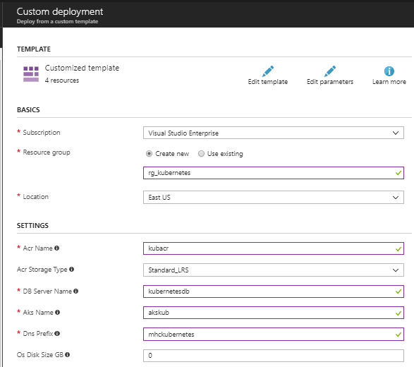
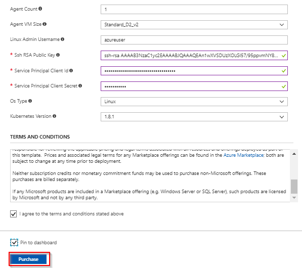
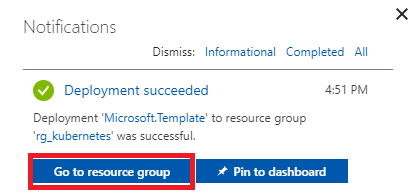
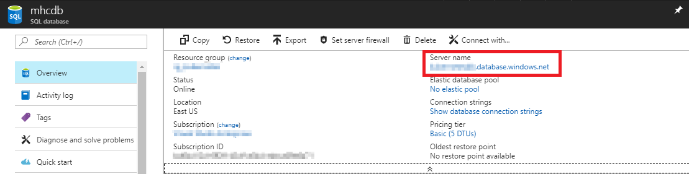
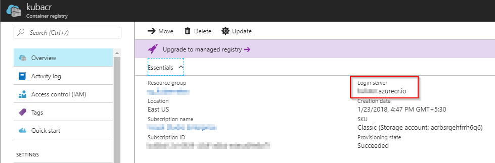
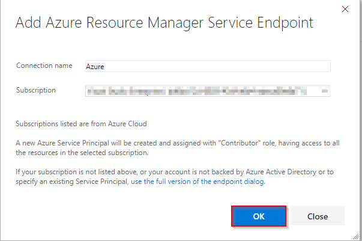
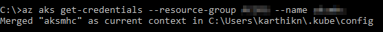
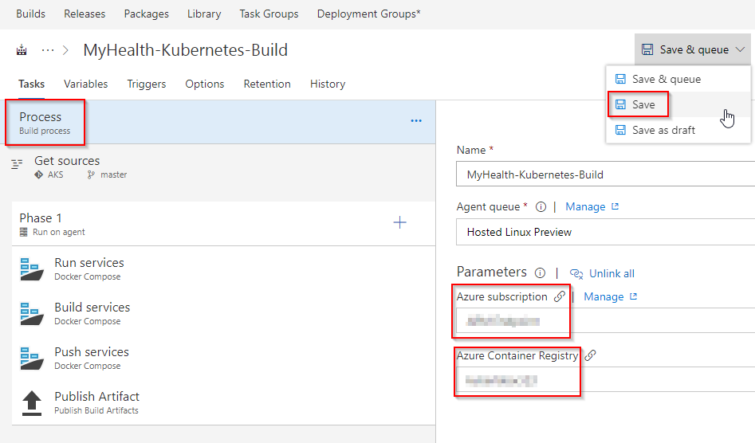
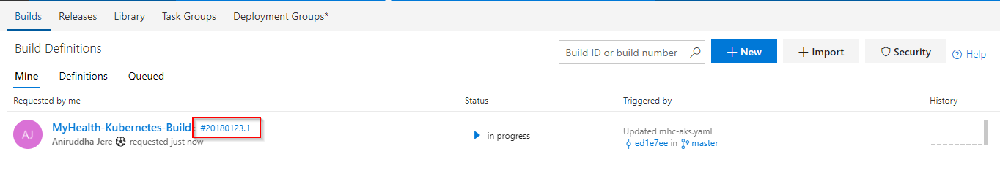
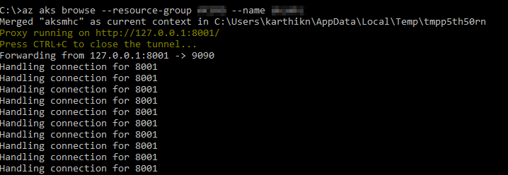

# Docker Deployment to Kubernetes (AKS) using VSTS

## Overview

Container deployment makes it easy to continuously update and improve your applications. Create replicable, manageable clusters of containers by orchestrating the continuous integration and deployment of those containers using Kubernetes or DC/OS in Azure Container Service. Use Visual Studio Team Services to deploy faster and more reliably by setting up a continuous build to produce and orchestrate your container images.

[**Azure Container Service (AKS)**](https://azure.microsoft.com/en-us/services/container-service/) is the quickest path from zero to Kubernetes on Azure. This new service features an Azure-hosted control plane, automated upgrades, self-healing, easy scaling, and a simple user experience for both developers and cluster operators. With AKS, customers get the benefits of open source Kubernetes without complexity and operational overhead.

This lab shows how to build custom images of ASP.NETCORE web application and deploy to **Azure Container Service (AKS)** using Visual Studio Team Services. These services run in a high-availability environment, patched and supported, allowing you to focus on your solution instead of the environment they run in.

Combination of Team Services and Azure will enable you to:

1. [Build](https://docs.docker.com/engine/reference/commandline/build/) your own custom images using [VSTS Hosted Linux agent](https://docs.microsoft.com/en-us/vsts/build-release/concepts/agents/hosted)
1. [Push](https://docs.docker.com/engine/reference/commandline/push/) and store images in your private repository
1. Deploy and [run](https://docs.docker.com/engine/reference/commandline/run/) images in managed Kubernetes AKS setup

In this lab you will:

- Create an Azure Container Registry (ACR), AKS and Azure SQL server
- Create VSTS project with .NET Core application 
- Configure endpoints in VSTS to access Azure and AKS
- Database deployment and configure CD in VSTS
- Update connection string & ACR in code
- Enable CI and Update Code to Trigger CI-CD

Below screenshot helps you understand the VSTS DevOps workflow with Azure Container Service with AKS:

- User commits changes to VSTS Git repository where the application code is hosted
- VSTS will build Docker image **myhealth.web** and push the image to Azure Container Registry tagged with buildID. VSTS will publish the Kubernetes [deployment YAML file](https://kubernetes.io/docs/concepts/workloads/controllers/deployment/) as a build artifact
- VSTS release will execute this YAML in the Kubernetes cluster where two deployments and services called **mhc-front** and **mhc-back** are created. **mhc-front** is the application hosted behind a load balancer while **mhc-back** is the [Redis](https://redis.io/) cache
- Kubernetes cluster will then pull **myhealth.web** image from Azure Container Registry into [Pods](https://kubernetes.io/docs/concepts/workloads/pods/pod/) and execute the rest of the deployment file instructions (create public endpoints etc.)
- You will be able to access the application via a browser after successful deployment

Terminologies used:

[**Pods**](https://kubernetes.io/docs/concepts/workloads/pods/pod/): A Pod is the basic building block of Kubernetes–the smallest and simplest unit in the Kubernetes object model that you create or deploy. A Pod represents a running process on your cluster.

[**Services**](https://kubernetes.io/docs/concepts/services-networking/service/): A Kubernetes Service is an abstraction which defines a logical set of Pods and a policy by which to access them - sometimes called a micro-service.

[**Deployments**](https://kubernetes.io/docs/concepts/workloads/controllers/deployment/): A Deployment controller provides declarative updates for Pods

[**Kubernetes Manifest file**](https://kubernetes.io/docs/reference/kubectl/cheatsheet/): Kubernetes manifests with deployments, services and pods can be defined in json or yaml. The file extension .yaml, .yml, and .json can be used.

## Pre-requisites

1. **Microsoft Azure Account**: You need a valid and active azure account for the labs.

1. You need a **Visual Studio Team Services Account** and [Personal Access Token](https://docs.microsoft.com/en-us/vsts/accounts/use-personal-access-tokens-to-authenticate)

1. You need to install **Kubernetes extension** extension from [Visual Studio Marketplace](https://marketplace.visualstudio.com/items?itemName=tsuyoshiushio.k8s-endpoint)

1. Install latest [Azure CLI](https://docs.microsoft.com/en-us/cli/azure/install-azure-cli?view=azure-cli-latest)

1. Install [KubeCtl](https://kubernetes.io/docs/tasks/tools/install-kubectl/), and make sure kubectl is added to [PATH Environment Variable](https://msdn.microsoft.com/en-us/library/office/ee537574(v=office.14).aspx)

1. Have a pair of public & private [SSH RSA keys](https://docs.microsoft.com/en-us/azure/virtual-machines/linux/ssh-from-windows)

1. You need [Azure Service Principal Client ID and Client Secret](https://docs.microsoft.com/en-us/azure/azure-resource-manager/resource-group-create-service-principal-portal)

## Setting up the Environment

We require below azure resources for this lab:

  <table width="100%">
    <thead>
      <tr>
         <th width="50%"><b>Azure resources</b></th>
         <th><b>Description</b></th>
      </tr>
    </thead>
    <tr>
      <td><b>Azure Container Registry</b></td>
      <td>Used to store images privately</td>
    </tr>
    <tr>
      <td> <b>AKS</b></td>
      <td>Docker images are deployed to Pods running inside AKS.</td>
    </tr>
    <tr>
      <td> <b>SQL Server</b> </td>
      <td>SQL Server to host database</td>
    </tr>
    </table>

1. Click on **Deploy to Azure** (or right click and select ***Open in new tab***) to spin up **Azure Container Registry**, **Azure Container Service (AKS)** and **Azure SQL Server**. Enter required details and agree to ***Terms and Conditions***, and click **Purchase**.

   

   **Note**: Use lower case for ***DB Server Name***. Click [here](https://azure.microsoft.com/en-in/regions/services/) to to see Azure products available by region.

   
   

1. It takes approximately 5 minutes to provision the environment. Click on **Go to resource group**.

   

1. Below components are created after deployment.

   

1. Click on **mhcdb** SQL database. Note down the **Server name**.

   

1. Go back to the resource group, click on container registry and note down the **Login server** name.

    

1. Switch back to the resource group. Click on your container service and note down the **API server address**. We need these details later in Exercise 2.

   

   Now that required the azure components are created, let us create a VSTS project.

## Setting up the VSTS Project

1. Use [VSTS Demo Data Generator](https://vstsdemogenerator.azurewebsites.net/?name=AKS&templateid=77363) to provision a project on your VSTS account.

    

1. Provide a Project Name, and click on Create Project.

   

1. Once the project is provisioned, click the **URL** to navigate to the project.

   

## Exercise 1: Endpoint Creation

Since the connections are not established during project provisioning, let us manually create the Azure and Kubernetes endpoints.

1. In VSTS, navigate to **Services** by clicking on the gear icon , and click on **+ New Service Endpoint**. Select **Azure Resource Manager**. Specify **Connection name**, select your **Subscription** from the dropdown and click **OK**. We use this endpoint to connect **VSTS** and **Azure**.

   

    You will be prompted to authorize this connection with Azure credentials. Disable pop-up blocker in your browser if you see a blank screen after clicking OK, and retry the step.

1. Click **+ New Service Endpoint**, and select **Kubernetes** from the list. We use this endpoint to connect **VSTS** and **Azure Container Service (AKS)**.

    For **Server URL** enter your container service **API server address** pre-fixed with **http://**

    To get **Kubeconfig** contents, run these commands from your Azure CLI.

    - **az login**

      Authorize your login by going to below url, and enter your unique code.

      

    - **az aks get-credentials --resource-group yourResourceGroup --name yourAKSname**

      

    - Navigate to **.kube** folder under your home directory (eg: C:\Users\YOUR_HOMEDIR\ .kube)

    - Copy contents from configuration file called **config** and paste it in the Kubernetes Connection window. Click **OK**.

      

## Exercise 2: Configure CI-CD

  Now that the connection is established, we will manually map the Azure endpoint, AKS and Azure Container Registry to build and release definitions.

 >Note : If you encounter an error - ***TFS.WebApi.Exception: Page not found*** for Azure tasks in the build/ release definition, you can fix this by typing a random text in the Azure Subscription field and click the **Refresh** icon next to it. Once the field is refreshed, you can select the endpoint from the drop down. This is due to a recent change in the VSTS Release Management API. We are working on updating VSTS Demo Generator to resolve this issue.

1. Go to **Builds** under **Build and Release** tab, **Edit** the build definition **AKS**.

   

1. In the **Process** section, select endpoint components from the dropdown under **Azure subscription** and **Azure Container Registry** as shown. Click **Save**.

    

    |Tasks|Usage|
    |-----|-----|
    | **Run services**| prepares suitable environment by restoring required packages|
    | **Build services**| builds images specified in a **docker-compose.yml** file with registry-qualified names and additional tags such as **$(Build.BuildId)**|
    | **Push services**| pushes images specified in a **docker-compose.yml** file, with multiple tags, to container registry|
    | **Lock services**| pulls image from default tag **latest** in container registry and verifies if uploaded image is up to date|
    | **Copy Files**| used to copy files from source to destination folder using match patterns|
    | **Publish Build Artifacts**| used to share the build artifacts|

1. Go to **Releases** under **Build & Release** tab, **Edit** the release definition **AKS** and select **Tasks**.

   

   

1. Under **Execute Azure SQL: DacpacTask**, update **Azure Subscription** from the dropdown.

    

1. Under **Create Deployments & Services in AKS** task, update **Kubernetes Service Connection**, **Azure subscription** and  **Azure Container Registry** with the endpoint components from the dropdown. Repeat similar steps for **Update image in AKS** task.

    

    

    - **Create Deployments & Services in AKS** will create deployments and services in AKS as per configuration specified in **mhc-aks.yaml** file. Pods will pull the latest image for first time.

    - **Update image in AKS** will pull the appropriate image corresponding to the BuildID from repository specified, and deploys the image to **mhc-front pod** running in AKS.

1. Click on **Variables** section, update **ACR** and **SQL server** with the details noted earlier while setting up the environment. Click **Save**.

   >Note: **Database Name** is set to **mhcdb**, **Server Admin Login** is **sqladmin** and **Password** is **P2ssw0rd1234**.

   

## Exercise 3: Update Connection String & ACR in Code

We will update the connection string in .NET Core application, and update ACR in manifest YAML file.

1. Go to **Code** tab, and navigate to the below path to **edit** the file **appsettings.json**

   >AKS/src/MyHealth.Web/**appsettings.json**

    Go to line number **9**. Paste the database server name as shown and manually update the **User ID** to **sqladmin** and **Password** to **P2ssw0rd1234**. Click **Commit**.

   

1. Navigate to the below path to **edit** the file **mhc-aks.yaml**.

    >AKS/**mhc-aks.yaml**

    Go to line number **93**. Update **YOUR_ACR** with your **ACR Login server** which was noted earlier while setting up the environment. Click **Commit**.

    

     This YAML manifest file contains configuration details of **deployments**, **services** and **pods** which will be deployed in Kubernetes.

## Exercise 4: Enable CI and Update Code to Trigger CI-CD

In this exercise, we will enable the continuous integration to trigger a build for each commit to the master branch, and update the code to trigger CI-CD. Our application is designed to be deployed in the pod with **load balancer** in front-end and **Redis cache** in the back-end.

1. Go to **Builds** under **Build and Release** tab, **Edit** the build definition **AKS**.

   

1. Click on **Triggers** section. Check the option to **Enable continuous integration**. Click **Save**.

    

1. Go to **Code** tab, and navigate to the below path to **edit** the file **Index.cshtml**

   >AKS/src/MyHealth.Web/Views/Home/**Index.cshtml**

   

1. Go to line number **28**, update **JOIN US** to **CONTACT US**, and click **Commit**.

    

1. Go to **Builds** tab. Click on the build number to see the build in progress.

    

    

1. The build will generate and push the image to ACR. After build completes, you will see the build summary.

    

1. To see the generated images in Azure Portal, go to **Azure Container Registry** and navigate to **Repositories**.

    

1. Switch back to VSTS. Go to **Releases** tab, and double click on latest release. Go to **logs** to see the release summary.

    

    

1. Once the release is complete, go to commandline and run below command to see the pods running in AKS:

    >**kubectl get pods**

    

    Our web application is running in these pods.

1. To access your application, run the below command. If you see that **External-IP** is pending, wait for a while until an IP is assigned.

    >**kubectl get service mhc-front --watch**

    

1. Copy **External-IP** and paste in your browser to see the changes.

    

    **To access AKS through browser:**

    >**az aks browse --resource-group=yourResourceGroup --name=yourAKSname**

    

     

    **AKS Dashboard:**

    

    >**Note**: To execute CI-CD for next time, update release definition **AKS**. Disable **Create Deployments & Services in AKS** task, and enable **Update image in AKS** task. This is to update the image every time build is done without disturbing the deployments and services running in Kubernetes.

## Summary

With **Visual Studio Team Services** and **Azure Container Services (AKS)**, we can build DevOps for dockerized applications by leveraging docker capabilities enabled on VSTS Hosted Agents.

## Feedback

Please let [us](mailto:devopsdemos@microsoft.com) know if you have any feedback on this lab.