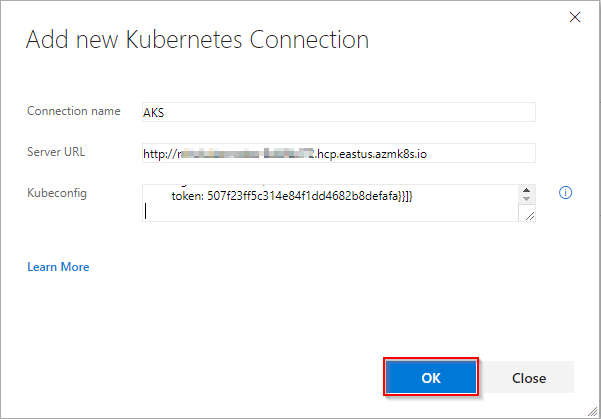
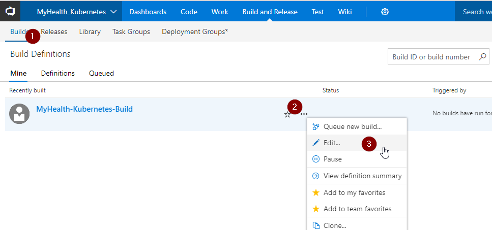
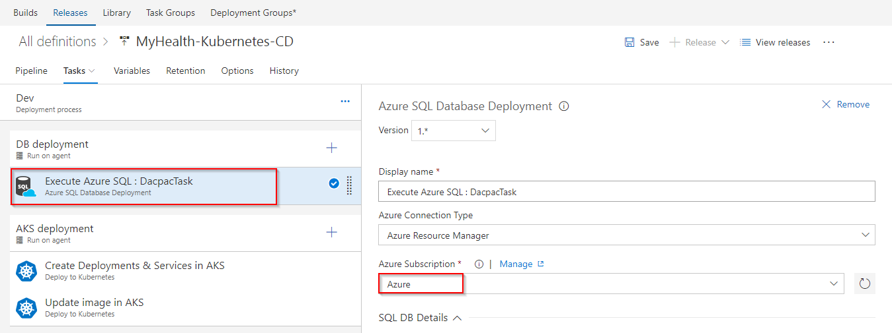

## Docker Deployment to Azure Container Service (AKS) using VSTS and Azure

## Overview

This lab shows how to build custom images of <a href="https://docs.docker.com/engine/examples/dotnetcore/">**Dockerized ASP.NETCORE**</a> web application, push those images to <a href="https://docs.docker.com/registry/"> **Private Repository** </a> (<a href="https://azure.microsoft.com/en-in/services/container-registry/"> Azure Container Registry </a>), and pull these images to deploy in **Azure Container Service (AKS)** using Visual Studio Team Services.

<a href="https://azure.microsoft.com/en-us/services/container-service/">**Azure Container Service (AKS)**</a> is the quickest path from zero to Kubernetes on Azure. This new service features an Azure-hosted control plane, automated upgrades, self-healing, easy scaling, and a simple user experience for both developers and cluster operators. With AKS, customers get the benefits of open source Kubernetes without complexity and operational overhead. Combination of Team Services and Azure integration with Docker will enable you to:

1.  <a href="https://docs.docker.com/engine/reference/commandline/build/"> Build </a> your own custom images using <a href="https://docs.microsoft.com/en-us/vsts/build-release/concepts/agents/hosted"> VSTS Hosted Linux agent </a>
2. <a href="https://docs.docker.com/engine/reference/commandline/push/"> Push </a> and store images in your private repository
3. Deploy and  <a href="https://docs.docker.com/engine/reference/commandline/run/"> run </a> images in managed Kubernetes setup

Below screenshot helps you understand the VSTS DevOps workflow with Docker: 

## Pre-requisites

1.  **Microsoft Azure Account**: You need a valid and active azure account for the labs.

2. You need a **Visual Studio Team Services Account** and <a href="https://docs.microsoft.com/en-us/vsts/accounts/use-personal-access-tokens-to-authenticate">Personal Access Token</a>.

3. You need to install **Kubernetes extension** extension from <a href="https://marketplace.visualstudio.com/items?itemName=tsuyoshiushio.k8s-endpoint">Visual Studio Marketplace</a>.

4. Install <a href="https://docs.microsoft.com/en-us/cli/azure/install-azure-cli?view=azure-cli-latest">Azure CLI</a>.

5. Install <a href="https://kubernetes.io/docs/tasks/tools/install-kubectl/">KubeCtl</a>.

6. Have a pair of public & private <a href="https://www.ssh.com/ssh/keygen/">SSH keys</a>.

## Setting up the Environment

We will create an **Azure Container Registry** to store the images generated during VSTS build. These images contain environment configuration details with build settings.  An **Azure Container Service (AKS)** is created where custom built images will be deployed to run inside container. **Azure SQL Database** along with **SQL Server** is created as a backend to **MyHealthClinic** .NetCore sample application.  

1. Click on **Deploy to Azure** (or right click and select ***Open in new tab***) to spin up **Azure Container Registry**, **Azure Container Service (AKS)** and **Azure SQL Database** along with **Azure SQL Server**. Enter required details such as Acr name, AKS Name and DB Server Name. Agree to ***Terms and Conditions***, and click **Purchase**.

    

    >Add custom deployment screenshot here

    Click  <a href="https://azure.microsoft.com/en-in/regions/services/"> here </a> to to see Azure products available by region.

    >**Note**: Use small case letters for ***DB Server Name***.
   
2. It takes approximately **3 to 4 minutes** to provision the environment. (update below pic later)

   

3. Below components are created post deployment. Click on **Azure Container Registry**.

      
    <table width="100%">
     <thead>
      <tr>
         <th width="50%"><b>Azure Components</b></th>
         <th><b>Description</b></th>
      </tr>
    </thead>
    <tr>
      <td><b>Azure Container Registry</b></td>
      <td>Used to store images privately</td>
    </tr>
    <tr>
      <td> <b>Storage Account</b></td>
      <td>Container Registry resides in this storage account</td>
    </tr>
    <tr>
      <td> <b>AKS</b></td>
      <td>Docker images are deployed to Pods running inside AKS.</td>
    </tr>
    <tr>
      <td> <b>SQL Server</b> </td>
      <td>SQL Server to host database</td>
    </tr>
    <tr>
      <td> <b>SQL database</b> </td>
      <td>SQL database to host MyHealthClinic data</td>
    </tr>
    </table>

    
    
   

4. Switch back to the Resource Group which you created. Click on **mhcdb** SQL database. Note down the **Server name**.

   

5. Go back to your resource group. Click on your container service and note down the **API server address**. We need these details later in Excercise 2.

   

6. To see the complete list of AKS components, click on your Resource Group list, and select the Resource Group starting with **MC_** and ending with your AKS name with the location.
   
   
 

## Setting up VSTS Project

1.  Use <a href="https://vstsdemogenerator.azurewebsites.net/?name=AKS&templateid=77363" target="_blank">VSTS Demo Data Generator</a> to provision a project on your VSTS account 

     

2. Select **AKS** for the template. Provide a Project Name, and click on Create Project.

   

3. Once the project is provisioned, click the **URL** to navigate to the project.

   

## Exercise 1: Endpoint Creation

Since the connections are not established during project provisioning, we will manually create the Azure endpoint. 

1. In VSTS, navigate to **Services** by clicking on the gear icon , and click on **+ New Service Endpoint**. Select **Azure Resource Manager**. Specify **Connection name**, select your **Subscription** from the dropdown and click **OK**. We use this endpoint to connect **VSTS** and **Azure**.

   

    You will be prompted to authorize this connection with Azure credentials. Disable pop-up blocker in your browser if you see a blank screen after clicking OK, and retry the step. 

2. Click **+ New Service Endpoint**, and select **Kubernetes** from the list. We use this endpoint to connect **VSTS** and **Azure Container Service (AKS)**. To get Kubeconfig contents, run this command from your Azure CLI.
    >**az login**

    >**az aks get-credentials --resource-group=yourResourceGroup --name=yourAKSname**

    a. Navigate to **.kube** folder under your home directory (eg: C:\Users\YOUR_HOMEDIR\ .kube)

    b. Copy contents from configuration file called **config** and paste it in the Kubernetes Connection endpoint pop-up window.

    c. Click OK.

    

## Exercise 2: Configure CI-CD

  Now that the connection is established, we will manually map the Azure endpoint, AKS and Azure Container Registry to build and release definitions. We will also deploy the dacpac to **mhcdb** database so that the schema is set for the backend.

 >Note : You will encounter an error - ***TFS.WebApi.Exception: Page not found*** for Azure tasks in the build/ release definition. This is due to a recent change in the VSTS Release Management API. While we are working on updating VSTS Demo Generator to resolve this issue, you can fix this by typing a random text in the Azure Subscription field and click the **Refresh** icon next to it. Once the field is refreshed, you can select the endpoint from the drop down.

1. Go to **Builds** under **Build and Release** tab, **Edit** the build definition **AKS**.

   

2. Click on **Process** section, select endpoint components from the dropdown under **Azure subscription** and **Azure Container Registry** as shown. Click **Save**.

    

    

   <table width="100%">
   <thead>
      <tr>
         <th width="50%"><b>Tasks</b></th>
         <th><b>Usage</b></th>
      </tr>
   </thead>
   <tr>
      <td><b>Run services</b></td>
      <td>prepares suitable environment by restoring required packages</td>
   </tr>
   <tr>
      <td><b>Build services</b></td>
      <td>builds images specified in a <b>docker-compose.yml</b> file with registry-qualified names and additional tags such as <b>$(Build.BuildId)</b></td>
   </tr>
    <tr>
      <td><b>Push services</b></td>
      <td>pushes images specified in a <b>docker-compose.yml</b> file, with multiple tags, to container registry</td>
   </tr>
    <tr>
      <td><b>Lock services</b></td>
      <td>pulls image from default tag <b>latest</b> in container registry and verifies if uploaded image is up to date</td>
   </tr>
   <tr>
      <td><b>Copy Files</b></td>
      <td>used to copy files from source to destination folder using match patterns </td>
   </tr>
   <tr>
      <td><b>Publish Build Artifacts</b> </td>
      <td> used to share the build artifacts </td>
   </tr>
   </table>

3. Go to **Releases** under **Build & Release** tab, **Edit** the release definition **AKS** and select **Tasks**.

   
    
    
   

4. Update **Azure Subscription** from the dropdown. 

    

5. Click on **Variables** section, update **SQLserver** with the details noted earlier while setting up the environment. Click **Save**. 

    

    >Note: **Database Name** is set to **mhcdb**, **Server Admin Login** is **sqladmin** and **Password** is **P2ssw0rd1234**.

6. Click on **Builds** tab and then click on build definition **AKS**. 

    

7. Queue a build by clicking **Queue new build**. Click on **Queue** in the pop-up window.

    

    The build will copy the dacpac to artifacts folder, which will be used in release for deploying this dacpac to database you created earlier. After this step is complete, the database schema will be deployed to SQL Database **mhcdb**.

    

8. Navigate to release definition **AKS** under **Releases** tab, and click on **Edit**. Click on **Tasks** and select **Phase1**. Under **Agent queue** select **Hosted Linux Preview** .

    

9. Right click on task **Execute Azure SQL : DacpacTask**, and select **Disable Selected Task(s)**. After this, right click on **Create Deployments & Services in AKS** task, and **Update image in AKS** task. Select **Enable Selected Task(s)**.

    

10. Under **Create Deployments & Services in AKS** task, update **Kubernetes Service Connection**, **Azure subscription** and  **Azure Container Registry** with the endpoint components from the dropdown. Repeat the same steps for **Update image in AKS** task. Click **Save**.

    

    a. **Create Deployments & Services in AKS** will create deployments and services in AKS as per configuration specified in **mhc-aks.yaml** file.

    b. **Update image in AKS** will pull the appropriate image corresponding to the BuildID from repository specified, and deploys the image to **mhc-front pod** running in AKS. 

## Exercise 3: Update Connection String

Now that the database schema is set, we will push some data into the tables and update the connection string in MyHealthClinic .NetCore application.

1. Click on **Code** tab, and navigate to **healthclinic.sql** file. Copy entire content of this file.

       

2. Switch to **Azure Portal**, and navigate to **mhcdb** SQL database which you created at the beginning of this lab. Click on **Data Explorer** and **Login**. Under authorization type **SQL server authentication** provide database **Login: sqladmin** and **Password: P2ssw0rd1234**. Click **OK**. 

       

3. Under **Query** section, paste the content copied from **healthclinic.sql** file as shown, and click on **Run**. This will now push required data into the database, so that our sample application MyHealthClinic could interact with it. Verify that message **Query succeeded** is displayed at the bottom. 

     

4.  Scroll down and select **Connection Strings** section. Copy the contents as shown.

     

5. Switch to your VSTS account. Go to **Code** tab, and navigate to the below path to **edit** the file **appsettings.json** 

    >AKS/src/MyHealth.Web/appsettings.json

    Go to line number **9**. Paste the connection string as shown and manually update the **User ID** to **sqladmin** and **Password** to **P2ssw0rd1234**. Click on **Commit**.

   

## Exercise 4: Update Secret

1. To access Azure Container Registry from AKS, you need to create a secret. From commandline, use **az login** to access your azure account 

2. To connect to the Kubernetes cluster from your computer, use **kubectl**, the Kubernetes command-line client.

    For installing it locally, run the following command:

    >az aks install-cli

**Connect with kubectl:**

To configure kubectl to connect to your Kubernetes cluster, run the following command:

>az aks get-credentials --resource-group=myResourceGroup --name=myK8sCluster

>kubectl create secret docker-registry SECRET_NAME --docker-server=REGISTRY_NAME.azurecr.io --docker-username=USERNAME --docker-password=PASSWORD --docker-email=ANY_VALID_EMAIL

**Create a secret called as acrconnection**

Get the current configuration of the ServiceAccount

>kubectl get serviceaccounts default -o yaml > ./serviceaccount.yml

Add below line to the end of the **serviceaccount.yml** file:

>imagePullSecrets:  
-name: acrconnection

Replace the current configuration of the ServiceAccount with this new one:
>kubectl replace serviceaccount default -f ./serviceaccount.yml

Now when we deploy images located in our Azure Container Registry, the images can be pulled by Kubernetes.

**To access AKS through browser:**

>az aks browse --resource-group AKS-RG1 --name aks

 

**AKS Dashboard:**

## Exercise 4: Enable CI and Update Code

In this excercise, we will enable the continuous integration trigger to create a new build for each commit to the master branch, and update the code to trigger CI-CD. As per instructions mentioned in **mhc-aks.yml** file the required Pods and Services are created in AKS. Our application is deployed behind a loadbalancer with the Redis cache.

1. Go to **Builds** under **Build and Release** tab, **Edit** the build definition **Docker**.

   

2. Right click on each task **Run Services**, **Build Services**, **Push Services** and **Lock Services** one by one (or use Ctrl+Click to select multiple tasks, and then right click). Select **Enable Selected Task(s)** to enable all of these tasks. Disable **Copy Files** and **Publish Artifact** tasks by selecting **Disable Selected Task(s)** after right clicking on each of them.

    

3. Click on **Triggers** section. Check the option to **Enable continuous integration**. Click **Save**.

    

4. Go to **Code** tab, and navigate to the below path to edit the file- 

   >Docker/src/MyHealth.Web/Views/Home/**Index.cshtml**

   

2. Go to line number **28**, update **JOIN US** to **JOIN US!!!**, and click **Commit**.

    

3. Go to **Builds** tab to see the CI build in progress.

    

4. The build will generate and push the image to ACR. After build completes, you will see the build summary. 
    
    
   

5. Go to **Releases** tab to see the release summary.

    

6. Go to commandline and run below command to see the pods:

    >kubectl get pods

    

      

8. To get the IP address, run below command. If you see that External-IP is pending, wait for a while until an IP is assigned.

    >kubectl get service mhc-front --watch

    
 
9. Copy External-IP and paste it in your browser.

    

8. To see the generated images in Azure Portal, go to **Azure Container Registry** and navigate to **Repositories**.

    

## Summary

With **Visual Studio Team Services** and **Azure Container Services (AKS)**, we can build DevOps for dockerized applications by leveraging docker capabilities enabled on VSTS Hosted Agents.

## Feedback

Please let <a href="mailto:devopsdemos@microsoft.com">us </a> know if you have any feedback on this lab.