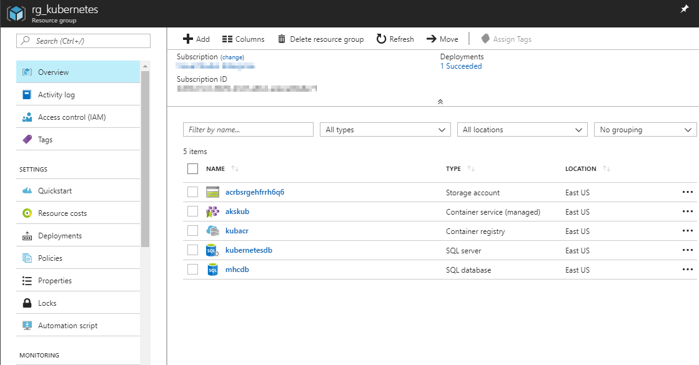
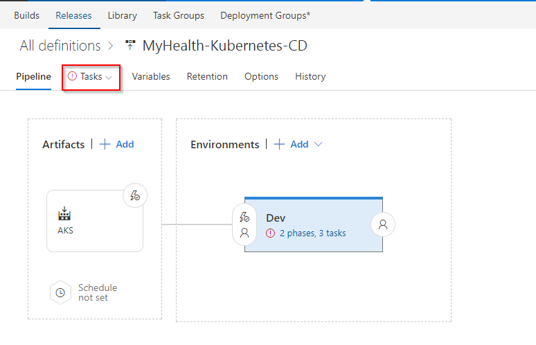
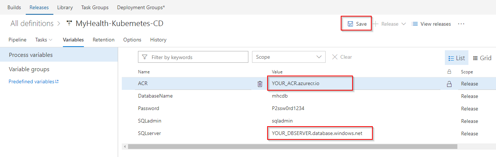
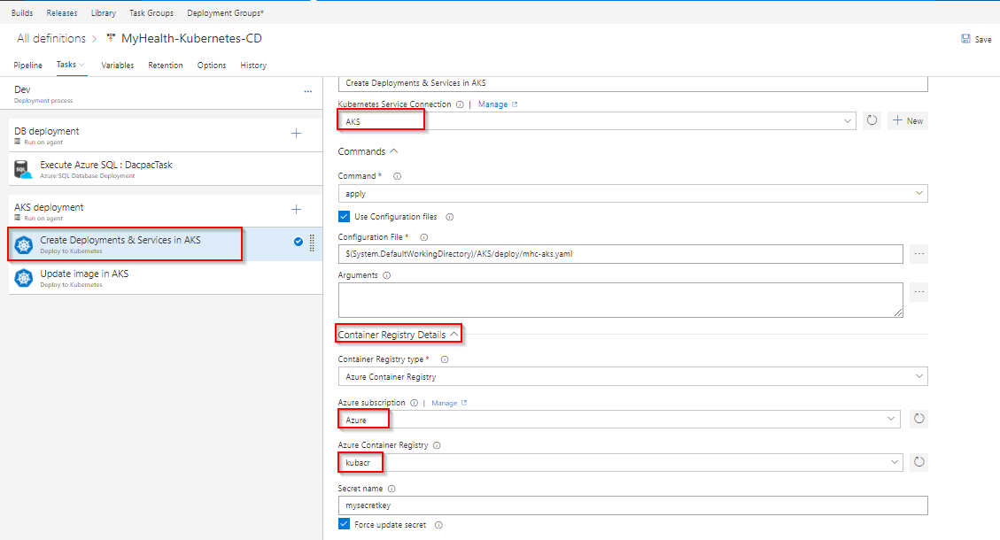
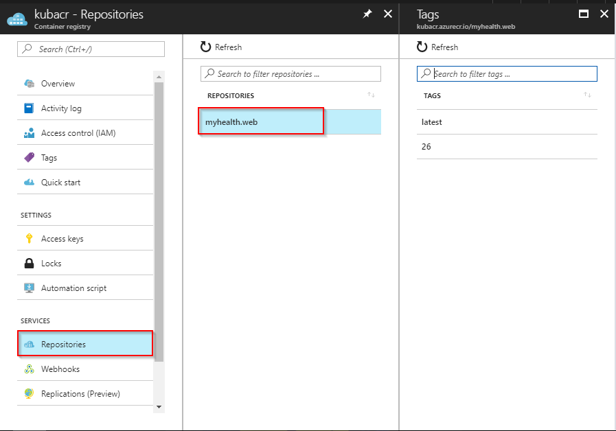

## Docker Deployment to Azure Container Service (AKS) using VSTS and Azure

## Overview

This lab shows how to build custom images of <a href="https://docs.docker.com/engine/examples/dotnetcore/">**Dockerized ASP.NETCORE**</a> web application, push those images to <a href="https://docs.docker.com/registry/"> **Private Repository** </a> (<a href="https://azure.microsoft.com/en-in/services/container-registry/"> Azure Container Registry </a>), and pull these images to deploy in **Azure Container Service (AKS)** using Visual Studio Team Services.

<a href="https://azure.microsoft.com/en-us/services/container-service/">**Azure Container Service (AKS)**</a> is the quickest path from zero to Kubernetes on Azure. This new service features an Azure-hosted control plane, automated upgrades, self-healing, easy scaling, and a simple user experience for both developers and cluster operators. With AKS, customers get the benefits of open source Kubernetes without complexity and operational overhead. Combination of Team Services and Azure integration with Docker will enable you to:

1.  <a href="https://docs.docker.com/engine/reference/commandline/build/"> Build </a> your own custom images using <a href="https://docs.microsoft.com/en-us/vsts/build-release/concepts/agents/hosted"> VSTS Hosted Linux agent </a>
2. <a href="https://docs.docker.com/engine/reference/commandline/push/"> Push </a> and store images in your private repository
3. Deploy and  <a href="https://docs.docker.com/engine/reference/commandline/run/"> run </a> images in managed Kubernetes setup

Below screenshot helps you understand the VSTS DevOps workflow with Docker: 

## Pre-requisites

1.  **Microsoft Azure Account**: You need a valid and active azure account for the labs.

2. You need a **Visual Studio Team Services Account** and <a href="https://docs.microsoft.com/en-us/vsts/accounts/use-personal-access-tokens-to-authenticate">Personal Access Token</a>.

3. You need to install **Kubernetes extension** extension from <a href="https://marketplace.visualstudio.com/items?itemName=tsuyoshiushio.k8s-endpoint">Visual Studio Marketplace</a>.

4. Install <a href="https://docs.microsoft.com/en-us/cli/azure/install-azure-cli?view=azure-cli-latest">Azure CLI</a>.

5. Install <a href="https://kubernetes.io/docs/tasks/tools/install-kubectl/">KubeCtl</a>, and make sure kubectl is added to <a href="https://msdn.microsoft.com/en-us/library/office/ee537574(v=office.14).aspx">PATH Environment Variable</a>.

6. Have a pair of public & private <a href="https://www.ssh.com/ssh/keygen/">SSH keys</a>.

## Setting up the Environment

We will create an **Azure Container Registry (ACR)** to store the images generated during VSTS build. These images contain environment configuration details with build settings.  An **Azure Container Service (AKS)** is created where custom built images will be deployed to run inside container. **Azure SQL Database** along with **SQL Server** is created as a backend to **MyHealthClinic** .NetCore sample application.  

1. Click on **Deploy to Azure** (or right click and select ***Open in new tab***) to spin up **Azure Container Registry**, **Azure Container Service (AKS)** and **Azure SQL Database** along with **Azure SQL Server**. Enter required details such as Acr name, AKS Name and DB Server Name. Agree to ***Terms and Conditions***, and click **Purchase**.

    

    Click  <a href="https://azure.microsoft.com/en-in/regions/services/"> here </a> to to see Azure products available by region.

    >**Note**: Use small case letters for ***DB Server Name***.

    >Add custom deployment screenshot here
   
2. It takes approximately **3 to 4 minutes** to provision the environment. Click on **Go To resource group**. (update below pic)

   

3. Below components are created post deployment.
      
    <table width="100%">
     <thead>
      <tr>
         <th width="50%"><b>Azure Components</b></th>
         <th><b>Description</b></th>
      </tr>
    </thead>
    <tr>
      <td><b>Azure Container Registry</b></td>
      <td>Used to store images privately</td>
    </tr>
    <tr>
      <td> <b>Storage Account</b></td>
      <td>Container Registry resides in this storage account</td>
    </tr>
    <tr>
      <td> <b>AKS</b></td>
      <td>Docker images are deployed to Pods running inside AKS.</td>
    </tr>
    <tr>
      <td> <b>SQL Server</b> </td>
      <td>SQL Server to host database</td>
    </tr>
    <tr>
      <td> <b>SQL database</b> </td>
      <td>SQL database to host MyHealthClinic data</td>
    </tr>
    </table>

    
    
   

4. Click on **mhcdb** SQL database. Note down the **Server name**.

   

5. Go back to your resource group. Click on container registry and note down the **Login server** name.

    

6. Switch back to your resource group. Click on your container service and note down the **API server address**. We need these details later in Exercise 2.

   

7. To see the complete list of AKS components, click on your Resource Group list, and select the Resource Group starting with **MC_** and ending with your AKS name with the location.
   
   
 

## Setting up the VSTS Project

1.  Use <a href="https://vstsdemogenerator.azurewebsites.net/?name=AKS&templateid=77363" target="_blank">VSTS Demo Data Generator</a> to provision a project on your VSTS account 

     

2. Provide a Project Name, and click on Create Project.

   

3. Once the project is provisioned, click the **URL** to navigate to the project.

   

## Exercise 1: Endpoint Creation

Since the connections are not established during project provisioning, we will manually create the Azure and AKS endpoints. 

1. In VSTS, navigate to **Services** by clicking on the gear icon , and click on **+ New Service Endpoint**. Select **Azure Resource Manager**. Specify **Connection name**, select your **Subscription** from the dropdown and click **OK**. We use this endpoint to connect **VSTS** and **Azure**.

   

    You will be prompted to authorize this connection with Azure credentials. Disable pop-up blocker in your browser if you see a blank screen after clicking OK, and retry the step. 

2. Click **+ New Service Endpoint**, and select **Kubernetes** from the list. We use this endpoint to connect **VSTS** and **Azure Container Service (AKS)**. 

    For **Server URL** enter your container service **API server address** pre-fixed with http://

    To get **Kubeconfig** contents, run these commands from your Azure CLI.
    
    (I). 
    >**az login**

    Authorize your login by going to below url, and enter your unique code.
    

    (II).
    >**az aks get-credentials --resource-group yourResourceGroup --name yourAKSname**

    

    a. Navigate to **.kube** folder under your home directory (eg: C:\Users\YOUR_HOMEDIR\ .kube)

    b. Copy contents from configuration file called **config** and paste it in the Kubernetes Connection endpoint pop-up window.

    c. Click **OK**.

    

## Exercise 2: Configure CI-CD

  Now that the connection is established, we will manually map the Azure endpoint, AKS and Azure Container Registry to build and release definitions. We will also deploy the dacpac to **mhcdb** database so that the schema and data is set for the backend.

 >Note : If you encounter an error - ***TFS.WebApi.Exception: Page not found*** for Azure tasks in the build/ release definition, you can fix this by typing a random text in the Azure Subscription field and click the **Refresh** icon next to it. Once the field is refreshed, you can select the endpoint from the drop down. This is due to a recent change in the VSTS Release Management API. We are working on updating VSTS Demo Generator to resolve this issue.

1. Go to **Releases** under **Build & Release** tab, **Edit** the release definition **AKS** and select **Tasks**.

   
    
    
   

2. Update **Azure Subscription** from the dropdown. 

    

3. Click on **Variables** section, update **ACR** and **SQLserver** with the details noted earlier while setting up the environment. Click **Save**.

    >Note: **Database Name** is set to **mhcdb**, **Server Admin Login** is **sqladmin** and **Password** is **P2ssw0rd1234**.

    

4. Go to **Builds** under **Build and Release** tab, **Edit** the build definition **AKS**.

   

5. Click on **Process** section, select endpoint components from the dropdown under **Azure subscription** and **Azure Container Registry** as shown. Click **Save & queue**.

    

    

   <table width="100%">
   <thead>
      <tr>
         <th width="50%"><b>Tasks</b></th>
         <th><b>Usage</b></th>
      </tr>
   </thead>
   <tr>
      <td><b>Run services</b></td>
      <td>prepares suitable environment by restoring required packages</td>
   </tr>
   <tr>
      <td><b>Build services</b></td>
      <td>builds images specified in a <b>docker-compose.yml</b> file with registry-qualified names and additional tags such as <b>$(Build.BuildId)</b></td>
   </tr>
    <tr>
      <td><b>Push services</b></td>
      <td>pushes images specified in a <b>docker-compose.yml</b> file, with multiple tags, to container registry</td>
   </tr>
    <tr>
      <td><b>Lock services</b></td>
      <td>pulls image from default tag <b>latest</b> in container registry and verifies if uploaded image is up to date</td>
   </tr>
   <tr>
      <td><b>Copy Files</b></td>
      <td>used to copy files from source to destination folder using match patterns </td>
   </tr>
   <tr>
      <td><b>Publish Build Artifacts</b> </td>
      <td> used to share the build artifacts </td>
   </tr>
   </table>

6. Click **Save & queue** in the pop-up window.
    
    

7. Click **Releases** and double click on latest release. Go to **logs** section to see the release summary.

    The build will copy the dacpac to artifacts folder, which will be used in release for deploying this dacpac to database you created earlier. After this step is complete, the database schema along with pre-configured data will be deployed to SQL Database **mhcdb**

    

8. Navigate to release definition **AKS** under **Releases** tab, and click on **Edit**. Right click on task **Execute Azure SQL : DacpacTask**, and select **Disable Selected Task(s)**. 

    

    Right click on **Create Deployments & Services in AKS** task and select **Enable Selected Task(s)**.

    

9. Under **Create Deployments & Services in AKS** task, update **Kubernetes Service Connection**, **Azure subscription** and  **Azure Container Registry** with the endpoint components from the dropdown. Repeat similar steps for **Update image in AKS** task. Click **Save**.

    

    

    a. **Create Deployments & Services in AKS** will create deployments and services in AKS as per configuration specified in **mhc-aks.yaml** file. Pods will pull the latest image for first time. 

    b. **Update image in AKS** will pull the appropriate image corresponding to the BuildID from repository specified, and deploys the image to **mhc-front pod** running in AKS. 

## Exercise 3: Update Connection String & ACR in Code

Now that the database schema and data is set, we will update the connection string in MyHealthClinic .NetCore application.

1. Switch to **Azure Portal**, and navigate to **mhcdb** SQL database which you created at the beginning of this lab. Scroll down and select **Connection Strings** section. Copy the contents as shown.

     

2. Switch to your VSTS account. Go to **Code** tab, and navigate to the below path to **edit** the file **appsettings.json** 

    >AKS/src/MyHealth.Web/**appsettings.json**

    Go to line number **9**. Paste the connection string as shown and manually update the **User ID** to **sqladmin** and **Password** to **P2ssw0rd1234**. Click **Commit**.

   

3. Navigate to the below path to **edit** the file **mhc-aks.yaml**. This file contains configuration details of **deployments** and **services** which will be deployed in Kubernetes.

    >AKS/**mhc-aks.yaml**

    Go to line number **93**. Update **YOUR_ACR** with your **ACR Login server** which was noted earlier while setting up the environment. Click **Commit**.

    

## Exercise 4: Enable CI and Update Code to Trigger CI-CD

In this exercise, we will enable the continuous integration trigger to create a new build for each commit to the master branch, and update the code to trigger CI-CD. As per instructions mentioned in **mhc-aks.yml** file the required deployments and services will be created in Kubernetes. Our application is designed to be deployed with **loadbalancer** in front end and **redis cache** in the back end.

1. Go to **Builds** under **Build and Release** tab, **Edit** the build definition **Docker**.

   

2. Right click on each task **Run Services**, **Build Services**, **Push Services** and **Lock Services** one by one (or use Ctrl+Click to select multiple tasks, and then right click). Select **Enable Selected Task(s)** to enable all of these tasks.

    

3. Click on **Triggers** section. Check the option to **Enable continuous integration**. Click **Save**.

    

4. Go to **Code** tab, and navigate to the below path to **edit** the file **Index.cshtml**

   >AKS/src/MyHealth.Web/Views/Home/**Index.cshtml**

   

5. Go to line number **28**, update **JOIN US** to **JOIN US TODAY**, and click **Commit**.

    

6. Go to **Builds** tab. Click on the build number to see the build in progress.

    

7. The build will generate and push the image to ACR. After build completes, you will see the build summary. 
    
    

8. To see the generated images in Azure Portal, go to **Azure Container Registry** and navigate to **Repositories**.

    
   
9. Switch back to VSTS. Go to **Releases** tab, and double click on latest release. Go to **logs** to see the release summary.

    

10. Once the release is complete, go to commandline and run below command to see the pods running in AKS:

    >**kubectl get pods**

    

11. To access your application, run the below command. If you see that External-IP is pending, wait for a while until an IP is assigned.

    >**kubectl get service mhc-front --watch**

    
 
12. Copy **External-IP** and paste in your browser.

    

    **To access AKS through browser:**

    >**az aks browse --resource-group=yourResourceGroup --name=yourAKSname**

    

     

    **AKS Dashboard:**

    

    >Note: To execute CI-CD for next time, update release definition **AKS** by disabling **Create Deployments & Services in AKS** task, and enabling **Update image in AKS** task. This is to update the image every time build is done without disturbing the deployments and services in Kubernetes.

## Summary

With **Visual Studio Team Services** and **Azure Container Services (AKS)**, we can build DevOps for dockerized applications by leveraging docker capabilities enabled on VSTS Hosted Agents.

## Feedback

Please let <a href="mailto:devopsdemos@microsoft.com">us </a> know if you have any feedback on this lab.